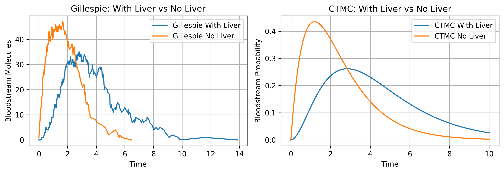
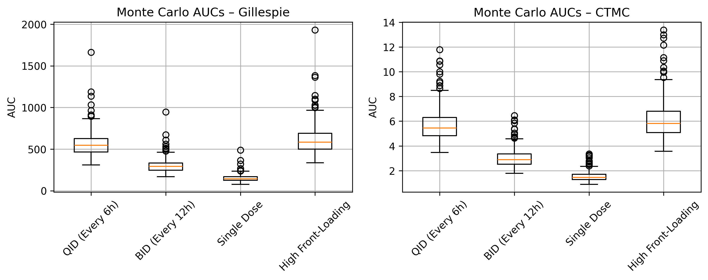
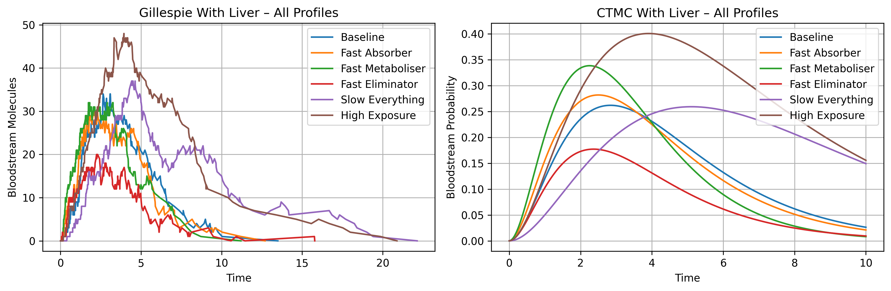

# Pharmacokinetic Drug Simulation

[](https://www.python.org/)  

Simulates drug absorption, liver metabolism, and elimination to evaluate optimal dosing strategies across a population. Demonstrates how patient variability affects drug exposure and highlights the importance of personalised medicine.

---

## Techniques
- **Gillespie Algorithm** – stochastic molecule-level events  
- **CTMC (Continuous-Time Markov Chains)** – probabilistic compartment transitions  
- **Monte Carlo Simulation** – population variability and AUC analysis  

---

## Key Findings
- Liver metabolism delays peak bloodstream concentrations and reduces peak levels  
- Patient variability significantly affects exposure; no single dosing strategy is universally optimal  
- High front-loading dosing maximises exposure but increases toxicity risk in slow metabolisers  
- Single-dose strategies are predictable but may underperform in efficacy  

---

## Dosing Strategies Compared
| Strategy | Median AUC | Variability | Notes |
|----------|------------|------------|-------|
| Single Dose | Low | Low | Most predictable |
| BID (12h) | Medium | Medium | Balanced exposure |
| QID (6h) | Medium-High | Medium | Frequent dosing |
| High Front-Loading | High | High | Higher toxicity risk |

---

## Example Visualisations

**Liver vs No Liver (Gillespie vs CTMC):**  
  

**Monte Carlo AUC distributions:**  
  

**All Patient Profiles:**  
  

---

## Skills Demonstrated
- Stochastic and deterministic modelling  
- Numerical simulation and integration (AUC)  
- Python programming for scientific computing  
- Data visualisation and interpretation  
- Population-level modelling for personalised medicine  

---

## Next Steps
- Extend to multi-drug or organ-level compartment models  
- Validate against real-world pharmacokinetic datasets  
- Develop interactive dashboards for dosing strategy exploration  

---

## Usage

**Clone the repository and install dependencies:**
```bash
git clone https://github.com/yourusername/Stochastic-Markov-Pharmacokinetics.git
cd Stochastic-Markov-Pharmacokinetics
pip install -r requirements.txt

**Run simulations and generate visualisations:**
python examples/run_simulations.py
```
## Author
Developed by: @James-JH
